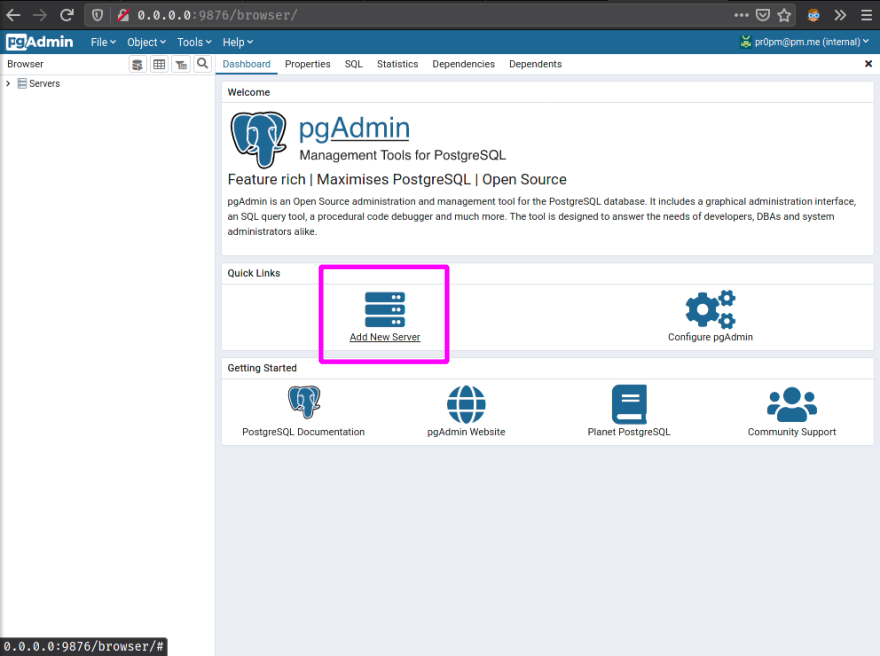
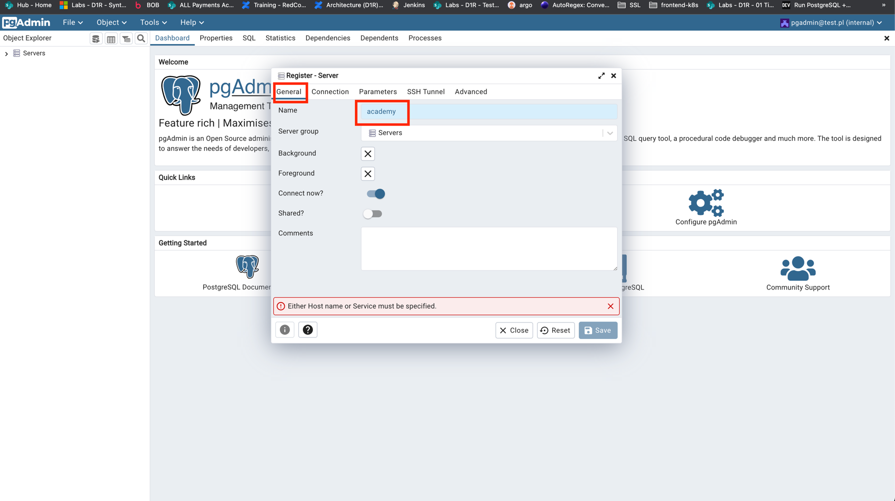
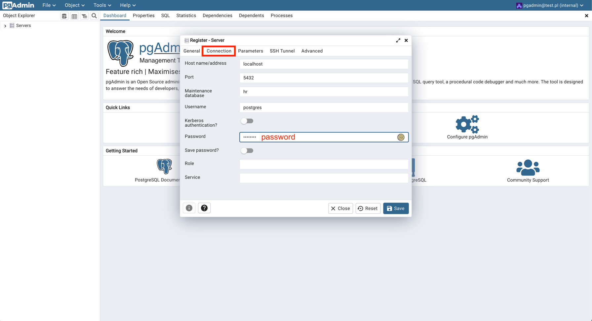
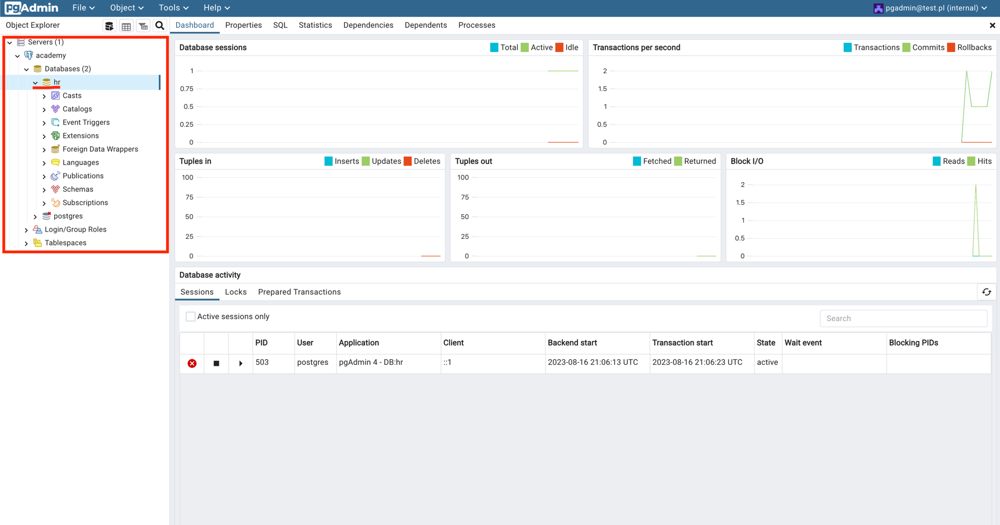
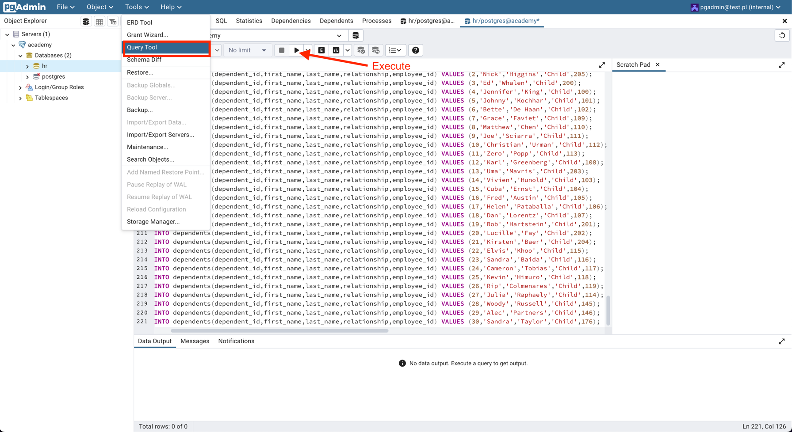
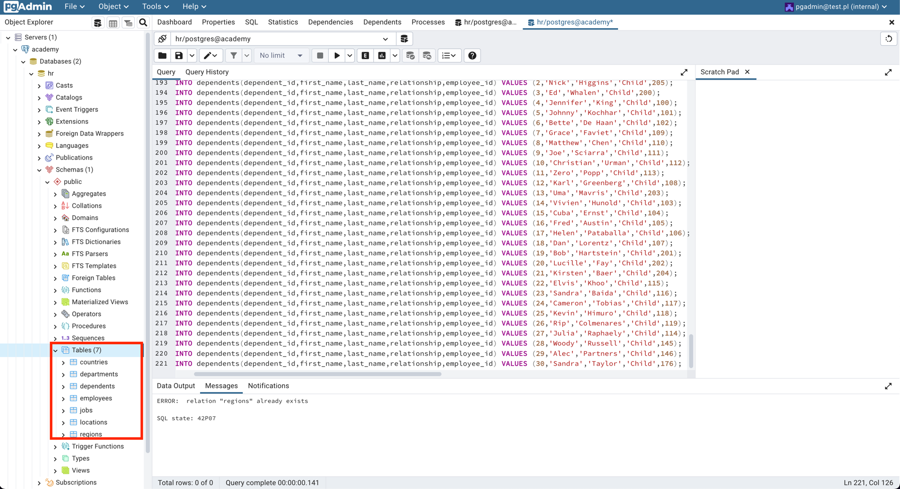

### Create containers:
1. Create pod: 

`podman pod create -n academy -p 55000:80 -p 5432:5432`

2. Create container for database and PgAdmin:

`podman run --pod=academy -e PGADMIN_DEFAULT_EMAIL=pgadmin@test.pl -e PGADMIN_DEFAULT_PASSWORD=password --name pgadmin -d dpage/pgadmin4`

`podman run --pod=academy -e POSTGRES_PASSWORD=password -e POSTGRES_USER=postgres --name postgres -d postgres`

3. healthcheck: pod with name "academy" status should be "Running":

`podman pod ps`

### Configure database

1. Go to localhost:55000 
2. Login with credentials: pgadmin@test.pl / password
3. Configure server:
Click "Add New Server":

Type name in "General" tab:

Fill form under "Connection" tab, as shown on screent shot (password=password)

Database should be visible:

4. Click on "hr" field and then on Menu Bar >> Tools >> Query Tool
5. Paste src/resources/init.sql script inside "Query" and execute:

Tables should be visible:

